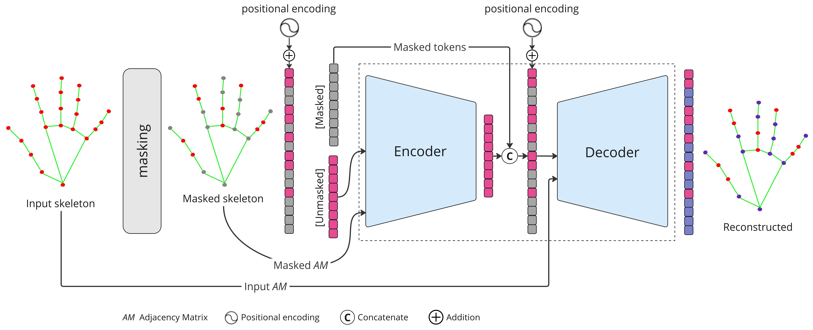

# **SkelMAE**
This repository contains the source code for our paper:
**Skeleton-based Self-Supervised Feature Extraction for Improved Dynamic Hand Gesture Recognition**



## **Updates**
- ...

## **Installation**
Create and activate conda environment:
```
conda create -n skelmae python=3.10
conda activate skelmae
```

Install all dependencies:
```
pip install -r requirements.txt
```

Install Jupyter Lab to visualize demo:
```
conda install -c conda-forge jupyterlab
```

Download the pre-trained weights file from [Google Drive](https://drive.google.com/file/d/1jnEIj0XQ5YA23HDItuF0gXMO-0UWTFK8/view?usp=drive_link). Move it to the `./weights` folder.


## Training
Dowload the evaluation datasets:
- [**Briareo**](https://aimagelab.ing.unimore.it/imagelab/page.asp?IdPage=31)
- [**IPN Hand**](https://gibranbenitez.github.io/IPN_Hand/)
- [**SHREC'17**](http://www-rech.telecom-lille.fr/shrec2017-hand/).
    
### Hand Pose Extraction
We use [MediaPipe](https://developers.google.com/mediapipe) framework to extarct hand poses from RGB images (for subsets (training,validation and testing).

```
python extract_hand_poses.py  --data_dir ./datasets/Briareo/ 
                              --annotations_file ./datasets/Briareo/train.zip 
                              --subset training
                              --save_dir ./datasets/Briareo/Landmarks/
```

### Training

Download [STGCN](https://github.com/yysijie/st-gcn) model.

```
bash train.sh --config_file configs/briareo_configs.yaml
```

## Evaluation

```
bash eval.sh --config_file configs/briareo_configs.yaml
```

## Citation
If you find this repo useful, please consider citing our paper

```ref```

We thank [MAE](https://github.com/facebookresearch/mae) and [STGCN](https://github.com/yysijie/st-gcn) for making their code available
